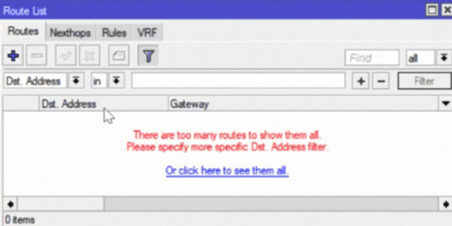
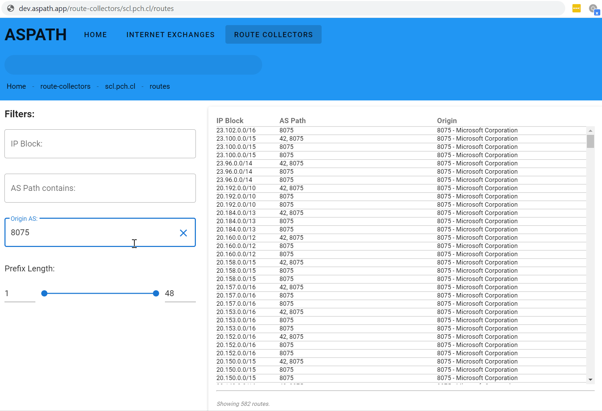
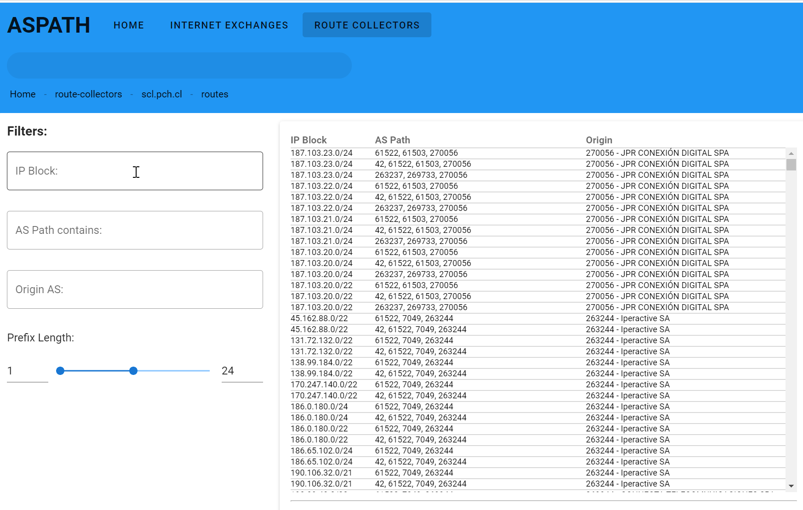
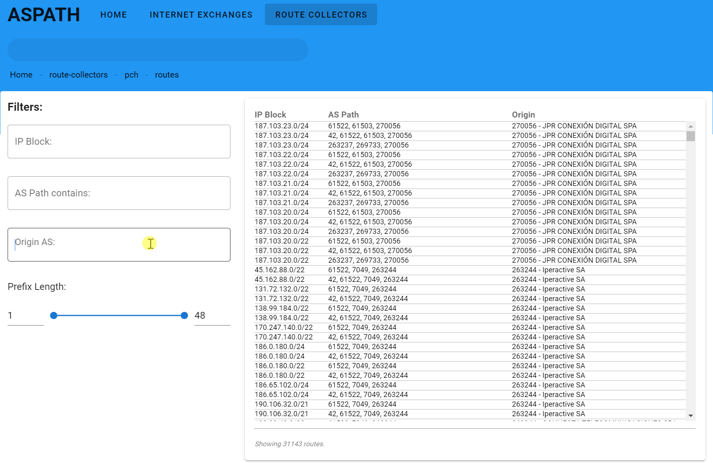
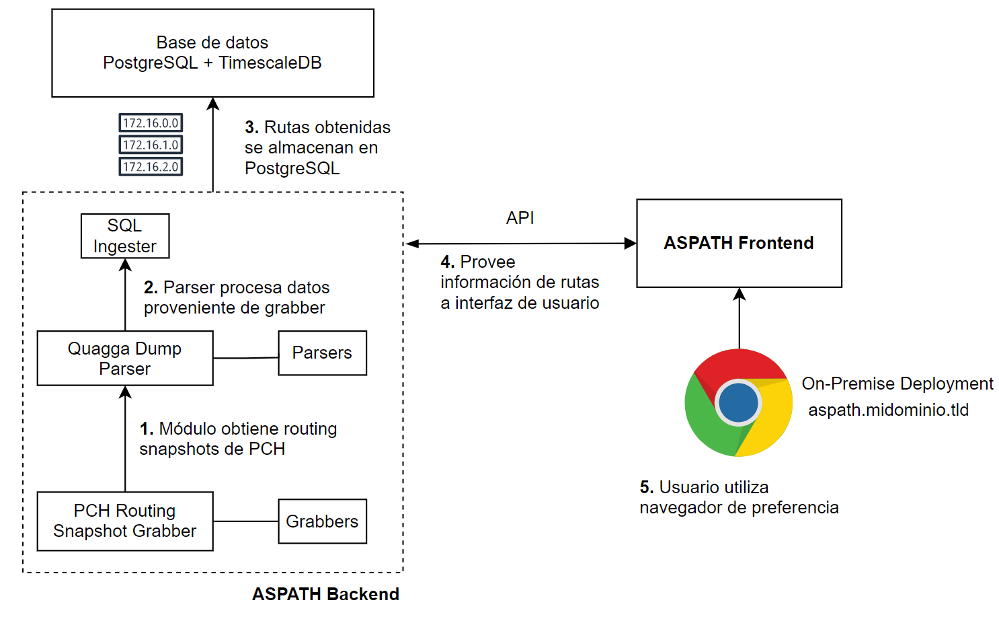
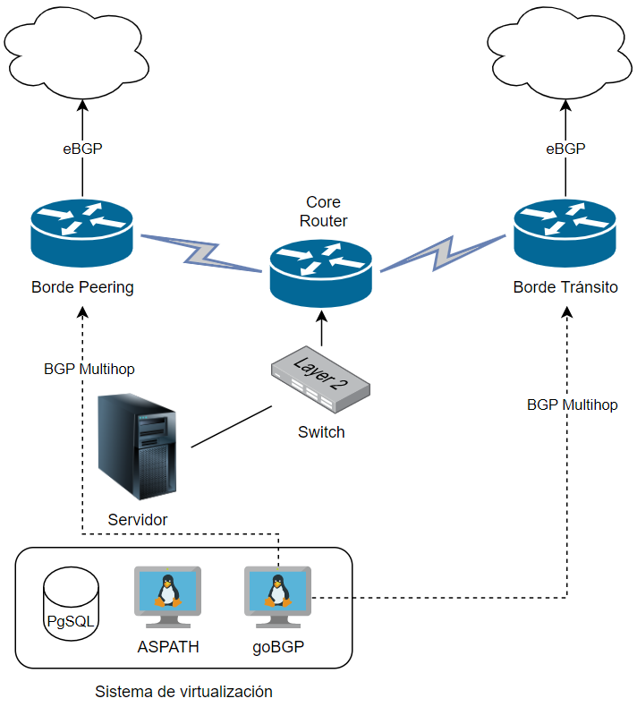

# ASPATH Project

Software open-source para monitoreo de colectores de rutas BGP.

##### Presenta:
###### Rodrigo Peña  Software Engineer

---

# Problemas comunes
- "Cierta página no carga/funciona 🤔" 
- "A que proveedor corresponde una dirección IP?"

- Búsqueda de causa
  - DNS ok? `dig lacnic.net`
  - Ping destino? `ping -f -c 100 lacnic.net`
  - **Problemas de ruteo**? bgp.he.net / BGPlay / `show ip bgp` / `traceroute` / ...

---

# Mikrotik way

La tentación existe, pero estás poniendo mucho en juego por querer visualizar la tabla de rutas

---

# Al momento de diagnosticar el problema ya desapareció

-**Azul**: Ya se arregló, sigo con mi vida
-**Roja**: Quiero saber la verdad

---

# Por qué es tan valioso investigar

- Posible Hijack BGP
- Definir responsabilidades
- **Robustecer estabilidad de la red**

---

- Posibilidad de explorar la tabla de ruteo a lo largo del tiempo
- Desde la comodidad del navegador web
- Implementable con cualquier router o servidor de rutas

---

- Explorador de snapshots de tabla de ruteo con tecnologías web.
- Permite **almacenar y visualizar** tablas de ruteo de múltiples equipos a lo largo del tiempo.
- Desplegable de manera privada
- Código abierto bajo licencia MIT

---

<h1 style="margin: 0 auto;">Cómo funciona</h1>

<ul>
  <li>
     Vista de snapshot proveniente de route collector de PCH.
  </li>
  <li>
     Filtros dinámicos para buscar dentro de tabla de ruteo.
  </li>
  <li>
     Lista de prefijos incluyendo otros datos como nombre de sistema autónomo.
  </li>
</ul>

---

<h1 style="margin: 0 auto;">Caso práctico: buscando anuncios extraños en intercambio de tráfico</h1>

<ul>
  <li>
     Búsqueda rápida sobre bloques con incidentes típicos.
  </li>
  <li>
     Se logra encontrar hijack presente por largo tiempo.
  </li>
</ul>

---

  <h1 style="margin: 0 auto;">Caso práctico: encontrando BGP Leaks en servidor de ruta</h1>

<ol>
  <li>
     Búsqueda de rutas provenientes de microsoft.
  </li>
  <li>
     Tras explorar tabla, se encuentran rutas con AS_PATH sospechosos.
  </li>
  <li>
     Se detecta BGP leak proveniente de inyección de rutas de tránsito hacia IXP.
  </li>
</ol>

---

# Cómo se implementa software ASPATH

- Actualmente, se consideran 2 métodos para agregar datos de ruteo al software:
  - **Quagga dump grabber**: Útil para trabajar con routing snapshots de proveído por terceros. **PCH provee routing snapshots diarios de sus colectores de rutas en este formato**.
  - **Colector GoBGP**: Implementación moderna de BGP. Se puede desplegar en una máquina virtual y hacer sesión multihop contra router de borde. <b>Implementación compatible con cualquier router que implemente BGP</b>.

---

  <h1 style="margin: 0 auto;">Diagrama de funcionamiento</h1>

<ul>
  <li>
     Proceso para alimentar al software con los Routing Snapshots disponibles desde Packet Clearing House.
  </li>
  <li>
     Este despliegue no requiere interacción con ningún router.
  </li>
</ul>

---

  <h1 style="margin: 0 auto;">Diagrama de funcionamiento para ISP</h1>
  <h2>Backbone de ejemplo</h2>

<ul>
  <li>
   Se instala <a href="https://osrg.github.io/gobgp/">goBGP</a> como colector de rutas.
  </li>
  <li>
   goBGP mantendrá sesiones multihop contra routers de borde
  </li>
  <li>
     ASPATH extraerá periódicamente la tabla de ruteo de goBGP para alimentar la base de datos.
  </li>
</ul>

---

# Roadmap
## Q2 2021
<ul>
  <li><b>Lanzamiento versión Beta</b></li>
  <li>Explorador de rutas  <small style="font-size: 11pt;"><strong>en progreso</strong></small></li>
  <li>Ver snapshots pasados  <small style="font-size: 11pt;"><strong>en progreso</strong></small></li>
  <li>Grabber Quagga y goBGP</li>
</ul>

## Q3 2021
<ul>
  <li>Lanzamiento versión estable</li>
  <li>Capacidad de compartir snapshots entre organizaciones</li>
</ul>

---

# Te necesitamos
- Operadores de red que deseen implementar software
- Desarrolladores que quieran ser parte del proyecto
  - Python, Javascript, Ruby

- Interesados: https://aspath.app
- Otros: Suscribirse al newsletter para recibir noticias del proyecto

---

# Proyecto bajo licencia MIT ¿🤔?
- Código abierto y disponible en https://aspath.app.
- Sin fees ni royalties.
- Se permite:
  - Uso comercial del software
  - Libre distribución y modificación de este.
  - Uso privado
---

# ¿Preguntas? 🤔

Software open-source para monitoreo de colectores de rutas BGP.

##### Presenta:
###### Rodrigo Peña  Software Engineer

